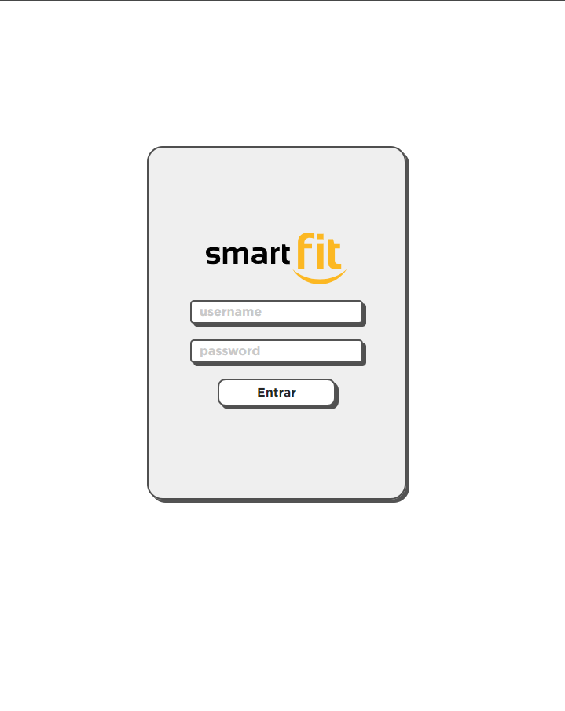
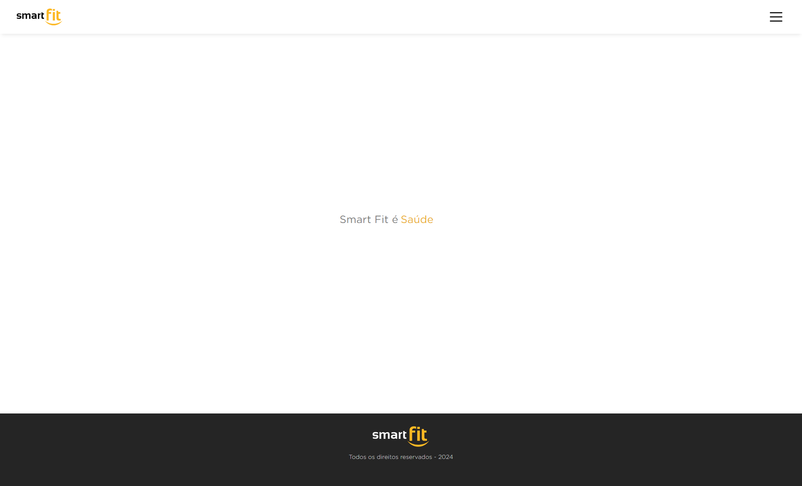
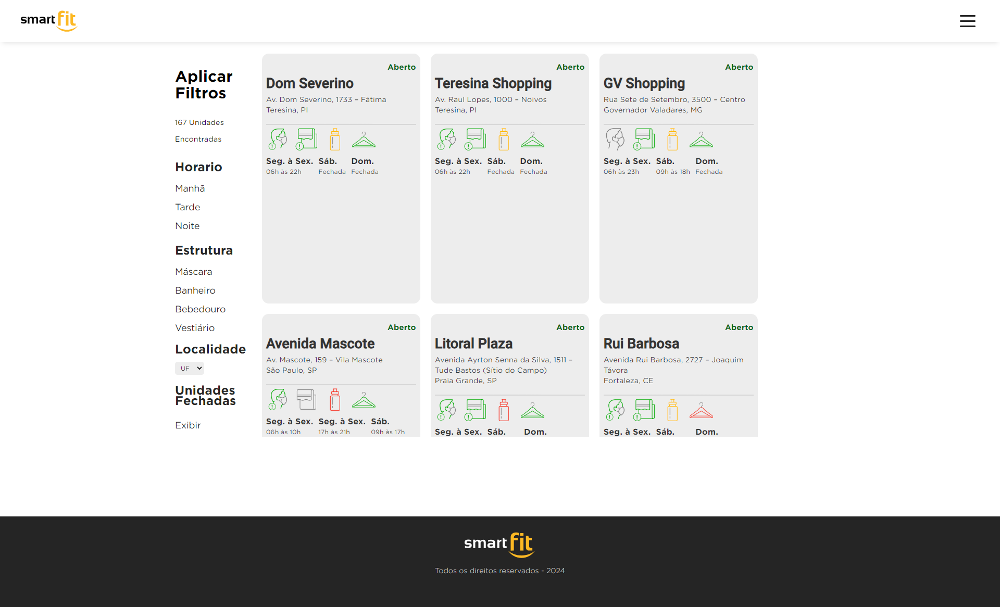

# Desafio Frontend - Smart Fit

### Frontend Challenge - Smart Fit


> Esse é um pequeno projeto criado no framework Angular como base para a avaliação de habilidades técnicas para o papel de Front-end.
>
> This is a small project created in the Angular framework as a basis for evaluating technical skills for the Front-end role.

# Protótipo Sugerido

### Suggested prototype


# Protótipo Criado

### Prototype Created

### Login 🔐



### Home 🏠



### Forms 📋



# Proposta de Teste

> A Smart Fit, por atuar no segmento de fitness, passou por várias mudanças na pandemia. Foi necessário desenvolver uma página para buscar unidades **fechadas** ou **abertas** para consulta e reserva.

### Funcionalidades

- Carrega unidades através do arquivo json `https://test-frontend-developer.s3.amazonaws.com/data/locations.json` com method `GET`
- Busca todas as unidades
- Busca unidades com filtros
- Mostra previsão de resultados encontrados
- Mostra unidades ao buscar

### Regras de negócio

- Filtrar unidades abertas ou fechadas
- Filtrar unidades por período de funcionamento
- Filtrar unidades por Estrutura (Máscara, Banheiros, Vestiário, Bebedouro)
- Validar para mostrar ícones corretos de acordo com o status
- Validação de Login do usuário
- Seção de Logout do usuário caso saia do sistema

### Organizações

- Principios de SOLID
- Aplicação baseada em design paterns
- Fragmentação em Componentes(Manutenibilidade do Código)
- Código limpo

### ⚙️ Como Executar

Para executar a aplicação localmente, siga os passos abaixo:

> 1. Clone este repositório:

```bash
  git clone https://github.com/dougaandrade/desafio-smart-fit
  cd desafio-smart-fit

```

> 2. Instale as dependências do projeto

```bash
  npm install -g @angular/cli
  npm install package.json

```

> 3. Inicie a aplicação

```bash
  ng serve

```

> 4. Usuario e senha

```bash
  http://localhost:4200/login admin 1234

```

# Test Proposal

> Smart Fit, as it operates in the fitness segment, went through several changes during the pandemic. It was necessary to develop a page to search for **closed** or **open** units for consultation and reservation.

### Functionalities

- Load units through the json file `https://test-frontend-developer.s3.amazonaws.com/data/locations.json` with method `GET`
- Search all units
- Search units with filters
- Shows prediction of results found
- Shows units when searching

### Business rules

- Filter open or closed units
- Filter units by operating period
- Filter units by Structure (Mask, Bathrooms, Changing Room, Drinking Fountain)
- Validate to show correct icons according to status
- Validation of login
- Logout section when logging out

### Organizations

- SOLID Principles
- Application based on design patterns
- Fragmentation of Components (Code Maintainability)
- Code clean

### ⚙️ How to Execute

To run the application locally, follow the steps below:

> 1. Clone this repository:

```bash
  git clone https://github.com/dougaandrade/desafio-smart-fit
  smart-fit challenge cd

```

> 2. Install dependencies

```bash
  npm install -g @angular/cli
  npm install package.json

```

> 3. Start the application

```bash
  ng serve

```

> 4. User and password

```bash
  http://localhost:4200/login admin 1234

```
