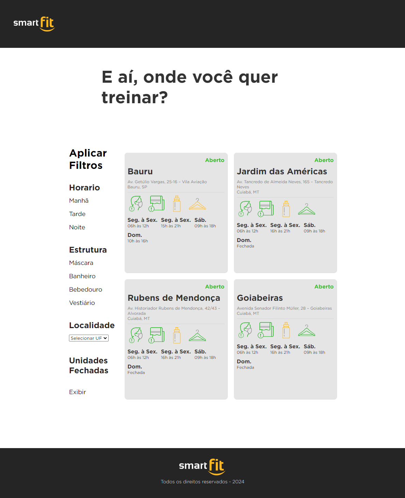

# Front-end Smart Fit
> Esse é um pequeno projeto criado como base para a avaliação de habilidades técnicas para o papel de Front-end.

# Preview

# Proposta de Teste
> A Smart Fit, por atuar no segmento de fitness, passou por várias mudanças na pandemia. Foi necessário desenvolver uma página para buscar unidades **fechadas** ou **abertas** para consulta e reserva.

> Optamos por não disponibilizar a API de buscas de unidades abertas/fechadas original para esse teste.

> Nesse teste você implementará as funcionalidades descritas abaixos. Tenha atenção com as regras de negócios definidas mais adiante.

> Lembre-se de **seguir o layout proposto** em _material.

> Caso não consiga concluir todas as funcionalidade, lembre-se que o mais importante é termos noção da qualidade do código e de suas habilidades para projeto de sistemas. Nesse caso, complemente sua solução com comentários e documentação sobre como terminaria o teste.

### Funcionalidades
- Carrega unidades através do arquivo json `https://test-frontend-developer.s3.amazonaws.com/data/locations.json` com method `GET`
- Busca todas as unidades
- Busca unidades com filtros
- Mostra previsão de resultados encontrados
- Mostra unidades ao buscar

### Regras de negócio
- Filtrar unidades abertas ou fechadas
- Filtrar unidades por período de funcionamento
- Caso não encontre unidades, mostrar uma menssagem ao usuário "Nenhuma unidade encontrada"
- Validar para mostrar ícones corretos de acordo com o status

### Componentes Macro
- Formulário de busca com filtros
- Legenda
- Lista de unidades

### Materiais disponíveis
> Em `./_material` você encontra:
- layout (mobile e desktop)
- Textos
- Cores
- imagens
- fonts

# Entrega
> No seu github, crie um repositório público com o teste e nos envie (caso queira enviar a url do app funcionando no Heroku, vercel ou equivalente seria um plus)

> Não faça Pull Request para esse repositório.

### Avaliação
- Instruções no README.md
- Lógica de programação
- Qualidade de código
- Qualidade de entrega (como se fosse para produção)
- Fidelidade ao layout proposto
- Responsive design
- cross browser and device (mobile, tablet e desktop)

> Plus
- Teste unitário e e2e (teste apenas o que achar mais importante).
- Travis CI
- App em produção (Ex.: Heroku, Vercel e etc...)
- Rodando com Docker localmente
